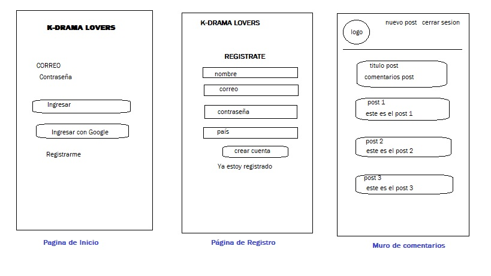
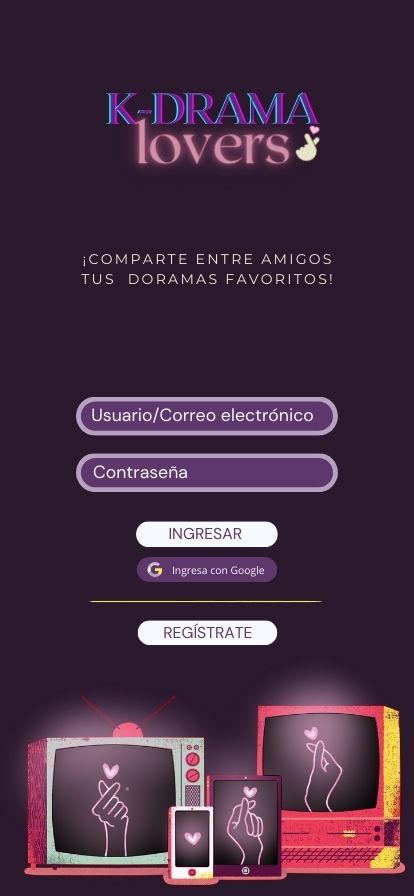
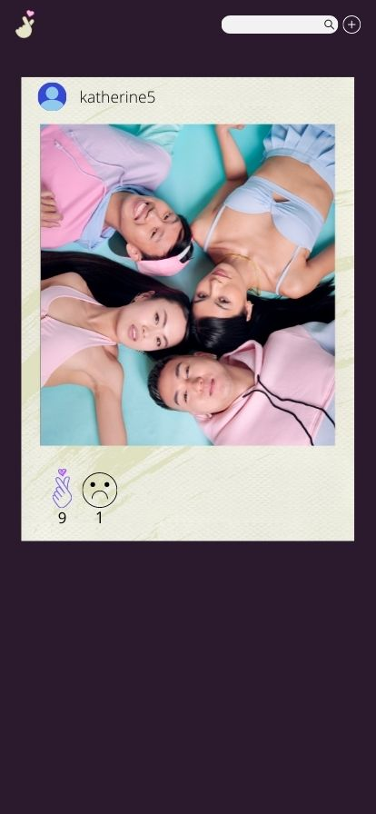

## Creando una Red Social  
# k-drama Lovers
## Blog para compartir tus series y novelas koreanas preferidas!

## Índice

* [1. Preámbulo](#1-preámbulo)
* [2. Resumen del proyecto](#2-resumen-del-proyecto)
* [3. Prototipos](#3-Prototipos)
* [4. Historias de Usuario](#4-Historias-de-Usuario)
* [5. Autoras](#5-Autoras)

## 1. Preámbulo

Las redes sociales hacen parte de nuestro día a día, por medio de ellas podemos compartir nuestros gustos con personas de todo el mundo. 

Con el fin de unir fronteras y personas nace K-DRAMA LOVERS, una red social en donde puedes compartir sobre las series y novelas koreanas que mas te gusten y que se encuentran en tendencia actualmente.

## 2. Resumen del proyecto

Es un proyecto construido para los amantes de las novelas y series Koreanas, una red social donde podrás iniciar sesión a través de su cuenta de Google predeterminada en su equipo ó podrá registrarse como usuario nuevo. 

Una vez el usuario pueda registrarse o ingresar a través de su cuenta de Google, se redireccionará al "feed" o muro de comentarios, donde podrá crear comentarios nuevos compartiendo sus gustos o preferencias y podrá visualizar los de otras personas. 

Al usuario titular del comentario le permitirá modificar su titulo o contenido dando click en el icono de lapiz o podrá eliminarlo si lo prefiere. 

También tendrá la opción de dar like a otros comentarios de diferentes usuarios.

La app estará dispuesta para adaptarse a diferentes dispositivos (móvil, tablet o desktop)
## 3. Prototipos

En el desarrollo de la app se creó un prototipo de baja fidelidad y alta fidelidad. 

### Prototipo baja fidelidad:

### Prototipo alta fidelidad:

### 4 Historias de usuario

En el proyecto se consideraron cinco (5) necesidades para el usuario:

* Historia de usuario No. 1 : Yo como amante de los K-dramas, Quiero registrarme en "K-drama Lovers", Para pertenecer a la comunidad de aficionados a las series koreanas, con correo electrónico y contraseña 

* Historia de usuario No. 2 : Yo como usuaria quiero poder registrarme en la k-drama lovers con mi cuenta de Google.

* Historia de usuario No. 3 : Yo como usuaria ya registrada de K-drama Lovers, quiero poder crear una publicación, para  compartirlo con otras personas (en el muro).

* Historia de usuario No. 4 : Yo como usuaria registrada quiero poder dar like a otros comentarios que sean de mi interés.

* Historia de usuario No. 5 : Yo como usuaria registrada quiero poder editar y/o eliminar mis publicaciones.

### 5.  Autoras

* Valentina Córdoba
* Alexandra Fuenmayor
* Katherine Cuartas Cardona

